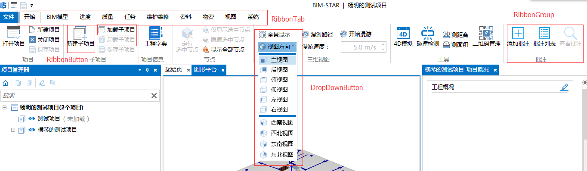
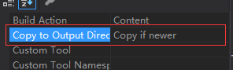

## Ribbon菜单 UI




## Ribbon菜单对应的相关类简介

- `RibbonManager `：`Ribbon`菜单管理类，在`WallE.Core`的命名空间中；提供操作管理`Ribbon`菜单的相关的方法。
- `RibbonTabViewModel`：对应`UI`中`RibbonTab` 。
- `RibbonGroupViewModel` ：对应`UI`中`RibbonGroup`。
- `RibbonButtonViewModel/RibbonDropDownButtonViewModel`：对应`UI`中 `RibbonButton`。

## 创建Ribbon菜单（两种方式）

1.1、`Xml`配置文件的方式 配置`Ribbon` 菜单。如下

```xml
<Tab Header="标题" Name="Tab"> //对应
  <Group Header="分组" Name="Group">
    <Button Text="点击" ButtonSize="Large" LargeImage="img.png" SmallImage="smallimg.png" Click="ClickButton"/>
    <Panel GroupType="Collapsible">
      <Button Text="新建项目" SmallImage="新建项目16.png" Click="NewProject"/>
    </Panel>
  </Group>
  <Group Header="子项目" Name="ProjectItemGroup">
    <DropDownButton Text="视图方向" ButtonSize=""  LargeImage="视图方向.png" SmallImage="视图方向16.png">
			<ContextMenu>
				<MenuGroupItem/>
					<ContextMenuItem Header="右视图" Icon="右视图16.png" Click="ViewRight"/>
				<MenuGroupItem/>
				<ContextMenuItem Header="西南视图" Icon="西南视图16.png"                                                        Click="ViewSouthwest"/>
			</ContextMenu>
		</DropDownButton>
  </Group>
</Tab>
```

- `Tab` 标签对应`RibbonTab` ，其属性，`Header`的值为显示的名称，`Name`为该`Tab`唯一的标识符（通过此值获取对应的`RibbonTabViewModel`对象。
- `Group` 标签对应`RibbonGroup`，其属性，`Header` 的值为显示的名称，`Name`为该`Group`唯一的标识符（通过此值获取对应的`RibbonGroupViewModel `对象。
- `Button` 标签对应`RibbonButton`，其属性，`Text`的值为显示名称，`Click `为点击事件的方法名称，`LargeImage`为大图标的图片， `SmallImage`为小图标图片， `ButtonSize` 为按钮的尺寸，其值为`Large`，`Medium`，`Small`。 对应`RibbonButtonViewModel`对象
- `DropDownButton` 标签对应的`DropDownButton`，可选；`Text`的值为显示名称，`Click `为点击事件的方法名称，`LargeImage`为大图标的图片， `SmallImage`为小图标图片， `ButtonSize` 为按钮的尺寸，其值为`Large`，`Medium`，`Small`。对应`RibbonButtonViewModel`对象
- `ContextMenu `标签对应的下拉的菜单。
- `MenuGroupItem`标签对应下拉菜单项的分组。
- `ContextMenuItem`标签对应具体的下拉菜单项，`Header`的值为显示名称，`Click `为点击事件的方法名称，`Icon`为图标 。

1.2、创建该`Xml`对应的`Viewmodel` 并继承与对应Xml中根元素对应的`VM`类，

```c#
    public class ViewTabViewModel:RibbonTabViewModel
    {
        public ViewTabViewModel() : base("Ribbons/ViewTab.xml", "")//第一个参数为xml的路径
        {                                                          //第二个参数为图片资源的路径
          //TODO
        }
    }
```

该方法会自动创建啊对应的`Tab`,`Group`,及`Button`相关的`VM`类。更多的使用方式见示例源码`Ribbon`部分

**注意**： `RibbonButtonViewModel`没有`RibbonButtonViewModel("Ribbons/ViewButton.xml","")`方法所以如果需要向已知的`RibbonGroup`中加入`RibbonButton`要使用如下的配置文件。

```xml
<Group  Name="ExampleGroup1">
  <Button Text="测试Button" ButtonSize="Large" CollapseToMedium="Never" LargeImage="打开项目.png" SmallImage="打开项目16.png" Click="Onclick"/>
  <Button Text="测试Button1" ButtonSize="Large" CollapseToMedium="Never" LargeImage="打开项目.png" SmallImage="打开项目16.png" Click="Onclick1"/>
  <Button Text="测试Button2" ButtonSize="Large" CollapseToMedium="Never" LargeImage="打开项目.png" SmallImage="打开项目16.png" Click="Onclick2"/>
</Group>
```

然后通过`RibbonGroup`解析此`xml`文件,如下：

```C#
public class ViewButtonViewModel:RibbonGroupViewModel
{
	public ViewButtonViewModel(): base("Ribbons/ViewButton.xml", "Assets")
	{ 
	}
}
ViewButtonViewModel buttonGroup=new ViewButtonViewModel();
//注意，如果向已知的RibbonGroup中添加RibbonButton 建议xml配置文件的外层直接加上group标签 如ViewButton.xml
//通过继承RibbonGroupViewModel 来解析配置文件得到其中的button 
_existGroup = M.RibbonManager.GetRibbonGroup(buttonGroup.Name);
_existGroup.Items.AddRange(buttonGroup.Items); 
```

2、使用代码配置`Ribbon`菜单

- 创建`RibbonTab`：

  ```C#
  M.RibbonManager.InsertRibbonTab(new RibbonTabViewModel()
  {
         Name = "Tab",
         Header = "开始",          
  },index);//Index为顺序，默认为最后一个
  ```


- 创建`RibbonGroup`：

  ```C#
  RibbonGroupViewModel group=new RibbonGroupViewModel()
  {
         Name = "Name",
         Header = "Header",               
  };
  ```


- 将`RibbonGroup`加入`RibbonTab`

  ```C#
   var tab = M.RibbonManager.GetRibbonTab("TabName");
   tab.Groups.Insert(0,new RibbonGroupViewModel()
   {
        Name = "Name",
        Header = "Header",
   });
  ```


- 创建`RibbonButton`

  ```C#
  RibbonButtonViewModel buttonVm = new RibbonButtonViewModel()
  {
       Name = "Name",
       Text = "Text",
       LargeImage = "url",
       ButtonSize = ButtonSize.Large,
       Click = new RelayCommand(OnClick)
  };
  ```


- 将`RibbonButton`加入到`RibbonGroup`

  ```c#
  var tab = M.RibbonManager.GetRibbonGroup("GroupName");
  tab.Items.Insert(0, new RibbonButtonViewModel()
  {
      Name = "Name",
      Text = "Text",
      LargeImage = "url",
      ButtonSize = ButtonSize.Large,
      Click = new RelayCommand(OnClick)
  });
  ```

## 移除Ribbon菜单

- 移除`RibbonTab`

  ```C#
  var tab = M.RibbonManager.GetRibbonTab("TabName");
  M.RibbonManager.RemoveRibbonTab(tab);
  ```

- 移除`RibbonGroup`

  ```C#
  var tab = M.RibbonManager.GetRibbonTab("TabName");//当前的Groupd的Tab
  var group = M.RibbonManager.GetRibbonGroup("GroupName");
  tab.Groups.Remove(group);
  ```

- 移除`RibbonButton`

  ```C#
  var group = M.RibbonManager.GetRibbonGroup("GroupName");
  group.Items.Remove(buttonVm);
  ```

  `buttonVm`为上述创建`RibbonButton`所得到的`VM`类。

## 挂载Ribbon菜单(采用配置方式挂载)

1、创建`xml`文件:

- 向已有的`RibbonTab`加入`RibbonGroup`

  ```xml
  <Group Header="分组" Name="Group">
      <Button Text="点击" ButtonSize="Large" LargeImage="img.png" SmallImage="smallimg.png" Click="ClickButton"/>
      <Panel GroupType="Collapsible">
        <Button Text="新建项目" SmallImage="新建项目16.png" Click="NewProject"/>
      </Panel>
    </Group>
  ```

- 向已有的`RibbonGroup`加入`RibbonButton`

  ```xml
   <Button Text="点击" ButtonSize="Large" LargeImage="img.png" SmallImage="smallimg.png" Click="ClickButton"/>
  ```

2、创建`tab`的配置文件，指定已有的`RibbonTab`的名称 ，如下（文件名为**`_config.xml`**）：

```xml
<Root InsertTabName="TabName/GroupName">//填写已知的TabName或这GroupName
</Root>
或者
<Root>
  <InsertTabName>TabName/GroupName</InsertTabName>
</Root>
```

3、创建配置文件解析类，解析上述的配置文件 如下（文件名及类名为**`LocalConfig.cs`**）：

```C#
public static class LocalConfig
{
    static LocalConfig()
    {
       //解析xml配置文件
        var root = XDocument.Load(typeof(LocalConfig).GetPluginResPath("_config.xml")).Root;
       //根据配置文件获取对应的节点或属性的值
        InsertTabName = root.Attribute("InsertTabName").Value;
       //InsertTabName = root.Element("InsertTabName").Value;
    }
    public static string InsertTabName { get; }
}
```

4、通过解析类`LocalConfig`可以得到当前的`RibbonGroup` 的`VM`

```c#
var tab = M.RibbonManager.GetRibbonTab(LocalConfig.InsertTabName);//当前的Groupd的Tab
或
var group= M.RibbonManager.GetRibbonGroup(LocalConfig.InsertTabName);//当前的Groupd的Tab
```

**注意**： 在插件的卸载方法中需要移除此插件中定义的相关菜单。

## Q/A

------

**Q**：`RibbonButton`样式怎么改变？

**A**：最常用的`RibbonButton`有两种一种是普通的`Button`，另一种为`DropDownButton`  

​	都有两种显示方式（通过`ButtonSize`属性控制)。

------


**Q**：已经按照步骤配置 但还是没有在`Ribbon`菜单中显示 

**A**：请先检查所在的已有`Tab`或者`Group`的插件是否有加载（见插件的配置项）；若没有，则先加载对应的插件；若还是没有显示新建的`Ribbon`菜单，检查xml文件的属性，采用`xml`文件配置是需要将改变`xml`文件的属性

------

**Q**：菜单读取不到图片

**A**：检查图片文件输出方式是否正确

​      若正确检查`ViewModel`中的图片的路径及文件夹是否正确，如下

```C#
    public class ViewGroupViewModel:RibbonGroupViewModel
    {
        public ViewGroupViewModel():base("Ribbons/ViewGroup.xml","Assets")
        {
        }
    }     
```

`Assets`为`ViewGroup.xml`中图片资源所在文件夹的相对路径，

------


**Q**：插件卸载时移除菜单，却将整个`RibbonGroup`中的`RibbonButton`移除

**A**：移除菜单是要注意只要移除当前插件所创建的`Ribbon`菜单，所以需要将创建的`RibbonButton`设为全局的 一遍在卸载的时候使用，如下：

```C#
private RibbonButtonViewModel buttonVm = CreateRibbonButton();

public void RemoveRibbonButton()
{
    var group = M.RibbonManager.GetRibbonGroup("GroupName");
    group.Items.Remove(buttonVm);
}
```