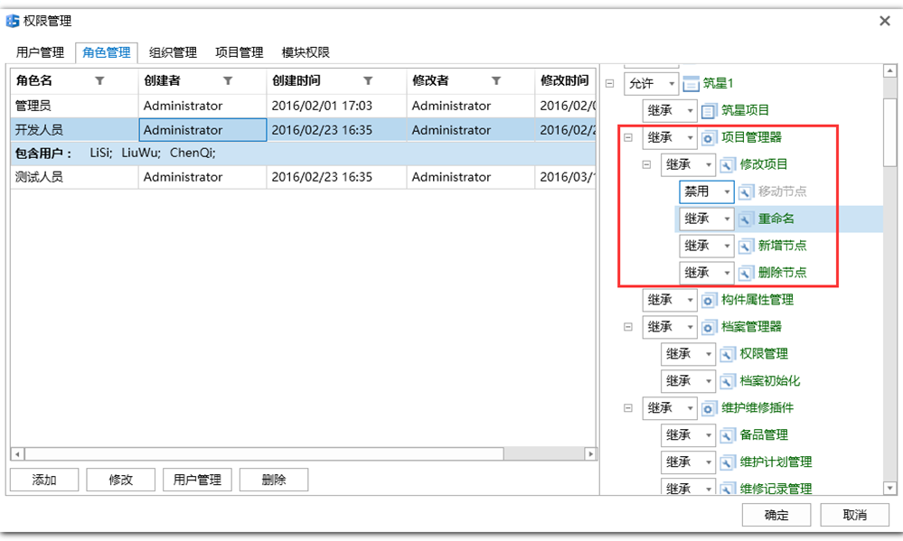

## 插件功能模块的设计和权限的管理简介

- 每个插件中可以设置若干模块，用户可以通过在权限管理中设置不同的权限来操作不同的功能。

  

其中表示插件表示项目,有关权限值的设置请看《用户手册》

**注意**：插件的权限 需要将插件的载入方式（及`LoadTime`）的值设为`LoadWhenLogined`或`LoadWhenProjectOpened`，否则无法在插件的列表中显示

## 模块定义

- 模块是在插件的配置文件中定义的（见[插件配置文件说明](https://github.com/bstar5/BSTAR-Samples/tree/master/samples/tutorial01#插件的配置文件详解)） 如下：

  ```xml
  <Modules>
    <Modules Key="337826FF-C6CA-41AE-9714-C243D8219E86" Name="修改项目" Description="项目管理器修改操作">
      <Module Key="8D24DDF1-7A90-44F0-A02F-43DEDB743693" Name="重命名" Description="节点树重命名"/>
      <Module Key="B5234DCF-9691-4902-9FFC-B7CADA9ABF27" Name="删除节点" Description="删除节点"/>
      <Module Key="9C69E508-6EAC-4534-A669-0041DDD775B7" Name="新增节点" Description="新增节点"/>
      <Module Key="4EE82473-DA62-4C30-A3D7-4D7B342C4398" Name="修改属性" Description="修改属性"/>
      <Module Key="FF3AFBBA-B29D-425E-9124-EEE60906B797" Name="移动节点" Description="移动节点"/>
    </Modules>
  </Modules>
  ```

  **注意**：配置文件的`model` 和`models` 是以树状结构定义的对应的权限管理中的树状结构，如上图

- 在配置文件中 `model`的属性`key` 用得到该模块的权限的级别，所以推荐定义一个类来管理这些`key` ,这里定义一个名为`ModuleKeys`的类  如下：

  ```C#
  public class ModuleKeys
  {
      public const string ModifyNode = "337826FF-C6CA-41AE-9714-C243D8219E86";
      public const string RenameNode = "8D24DDF1-7A90-44F0-A02F-43DEDB743693";
      public const string DeleteNode = "B5234DCF-9691-4902-9FFC-B7CADA9ABF27";
      public const string AddNewNode = "9C69E508-6EAC-4534-A669-0041DDD775B7";
      public const string MoveNode = "FF3AFBBA-B29D-425E-9124-EEE60906B797";
      public const string ModifyProperty = "4EE82473-DA62-4C30-A3D7-4D7B342C4398";
  }
  ```

## 模块和权限的使用

- 若需要在代码中使用权限来控制状态，可通过如下方式获取该模块的权限：

  ```C#
  var result = await M.EnvManager.GetCurrentUserRealPermissionAsync(ModuleKeys.RenameNode, projectId);
  return result > PrivilegeType.NoAccess;
  ```

  **说明**：`GetCurrentUserRealPermissionAsync` 该方法有三个重载方法：

  ```C#
   public static Task<PrivilegeType> GetCurrentUserRealPermissionAsync(this IEnvManager manager, int projectId);
   public static Task<PrivilegeType> GetCurrentUserRealPermissionAsync(this IEnvManager manager, string moduleKey, int projectId);
   public static Task<PrivilegeType> GetCurrentUserRealPermissionAsync(this IEnvManager manager, string moduleKey, string projectItemKey);
  ```

  `projectId` 为项目的`id`  ；`projectItemKey`为子项目的`id` ； `moduleKey` 为模块的`key`。

  **注意**：超级管理员的权限无法配置，默认都为**允许**，权限的设置只针对普通的用户。