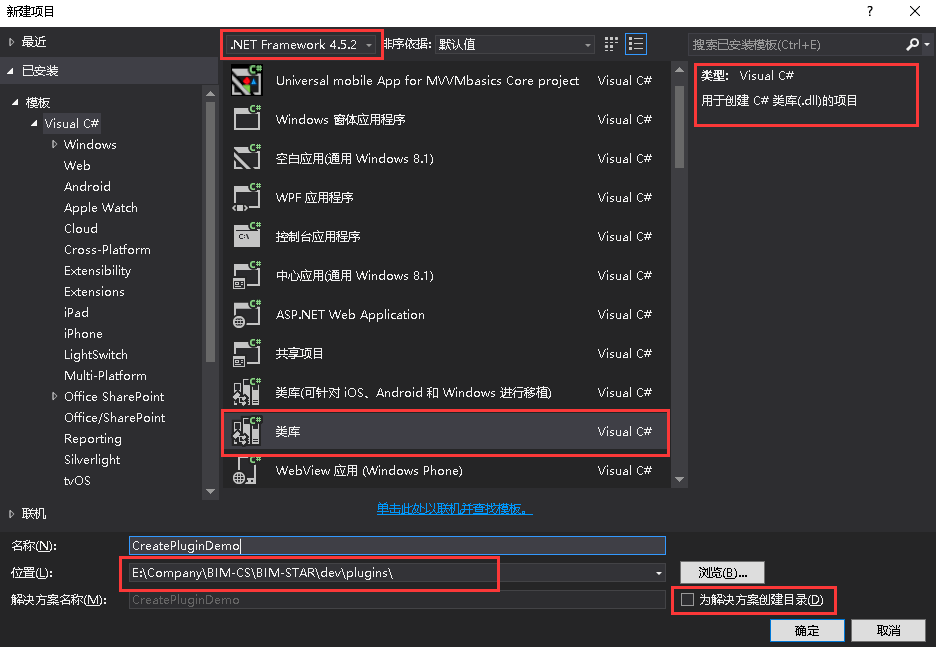

# 基本的插件开发流程

## 简单的示例

1. 在主程序BIM-STAR的plugins文件夹下新建解决方案及项目，如下图所示。

2. 右键引用，添加引用`WallE.Core.dll`，如下图所示。

   


3. 新建一个配置文件，命名为`config.plugin`，如下图所示。


4. 选中刚创建好的`config.plugin`，右键属性->复制到输出目录->选择` 如果较新则复制`，如下图所示。

   


5. 文件`config.plugin`的内容如下图所示。新创建的插件需要用新生成的GUID，FileName要写`所建的项目名.dll`，否则会出现加载动态库失败的异常。

```xml
<?xml version="1.0" encoding="utf-8" ?>
<Plugin Key="A59BA842-E6FF-4F40-97DE-9582FEA609AE"
        FileName="CreatePluginDemo.dll">
</Plugin>
```

6. 新建一个MainPlugin类，实现IPlugin接口，如下图所示。

```c#
using WallE.Core;
namespace CreatePluginDemo
{
    public class MainPlugin : IPlugin
    {
        public void Install(IPluginInfo pluginInfo)
        {
            this.ShowMessage("Hello World!");
            //加载插件时，执行的代码
        }
        public void Uninstall()
        {
            //卸载插件时，执行的代码
        }
    }
}
```

7. 右键项目->属性->调试->选择`启动外部程序`，将启动程序设为BIMSTAR.Main.exe，即可进行调试，如下图所示。Debug模式下可以在BIM-STAR\debug目录下找到BIMSTAR.Main.exe。


8. 这个时候F5运行项目，会发现输出栏提示新建的插件没有被加载的错误，这是因为新建插件的dll并没有拷贝到主程序下的plugins文件夹下。Debug模式下，BIM-STAR\Debug\plugins目录下需要有新建插件名称命名的文件夹，文件夹里需要有插件生成的dll和你项目所引用的的dll和一些配置文件，如下图所示。

   


9. 上一步你可以选择每次编译成功后手动拷贝过去，也可以每次编译成功后自动拷贝过去，下面介绍自动拷贝的技巧。

   右键项目->属性->生成事件，在后期生成事件命令行中输入如下代码。并将在运行后期生成事件选择`生成更新项目输出时`，如下图所示。如果插件项目的位置不在plugins文件夹内，需要修改第一行的代码，找到插件文件夹（plugins）的正确路径。这一步的目的是**每次编译成功后自动将该插件的输出文件复制到主程序所在目录的plugins文件夹**下。重新编译项目，如果发现在主程序所在目录的plugins文件夹下面生成了CreatePlugin文件夹，则大功告成！如果不理解命令行代码，可以百度查一下VS项目属性的配置项的详解，然后根据自己的实际情况进行修改。

```
cd $(ProjectDir)..\..\..\bin\plugins\
md $(TargetName)
xcopy $(TargetDir)..\$(ConfigurationName) $(TargetName) /Y /S
```


10.  这个时候F5运行项目，会发现程序启动时会弹出消息框，说明插件已经成功加载了，效果如下图所示。


## 插件的配置文件详解

+ 完整的`config.plugin`配置文件内容如下：

```xml
<?xml version="1.0" encoding="utf-8"?>
<Plugin Key="D7E55BDA-F4FF-48DA-A2B3-FD83CB7CFB5D" 
        FileName="DxGraphicPlatform.dll" 
        Name="图形平台" 
        Description="基于Dirext的图形平台"  
        Developer="深圳筑星科技有限公司" 
        LoadTime="LoadWhenLogined" 
        LoadOrder="0" 
        WebUrl="www.baidu.com" 
        Icon="Images/logo.jpg" >
  <CoreLibs>
    <Dll>Wbs.Core</Dll>
  </CoreLibs >
  <Refs>
    <Dll>SharpDX</Dll>
    <Dll Value="SharpDX.DXGI"/>
    <Dll FileName="SharpDX.D3DCompiler"/>
    <Dll>SharpDX.Direct3D11.dll</Dll>
  </Refs>
  <Modules>
    <Module Key="E51A355C-3349-4077-89BD-3EDFFCEAF97D" Name="模块1" Description="模块1">
    <Module Key="1AB14183-4ACA-4CC1-A524-84F65B8CBDBE" Name="模块1.1" Description="模块1.1" Type="Data">
    </Module>
    <Module Key="24F37107-DF80-4678-B58C-B3468A156B3B" Name="模块2" Description="模块2">
    <Module Key="B1457DD2-7F01-4653-B02E-8738BB15991B" Name="模块2.1" Description="模块2.1">
    </Module>
  </Modules>
  <SqlFiles>
    <SqlFile Name="sqls/v1.sql" Version="1"/>
    <SqlFile Name="sqls/v2.sql" Version="2"/>
  </SqlFiles >
</Plugin>
```

|    属性名称     | 描述                                       | 是否必填                 |
| :---------: | ---------------------------------------- | -------------------- |
|     Key     | 插件唯一编号，一个有效的Guid值                        | **是**                |
|  FileName   | 插件所在的dll名称                               | **是******            |
|    Name     | 插件名称                                     | 否                    |
| Description | 插件描述                                     | 否                    |
|  Developer  | 插件的开发者                                   | 否                    |
|  LoadTime   | 插件加载的时机，可选值：  LoadWhenStartup、LoadWhenLogined、LoadWhenProjectOpened | 否，默认为LoadWhenStartup |
|  LoadOrder  | 插件加载的顺序                                  | 否，默认为0               |
|   WebUrl    | 插件开发者的官网                                 | 否                    |
|    Icon     | 插件图标，图标必须在插件所在的文件夹下                      | 否                    |

+ CoreLibs节点下，表示该插件需要引用的其它扩展的核心dll，如果很多插件需要同时引用同一个库文件，可以将该库文件作为扩展的核心dll，如进度管理作为一个大模块，可以将共有的功能抽取出来，制作成一个扩展的核心dll，其它插件引用该dll时则需要插入该节点。如果插件不引用其它扩展的核心dll，可省略该节点。
+ Refs节点下中表示该插件需要引用的外部dll，若该插件不需要引用其它dll，可省略Refs节点。一般情况下均可省略该节点，如果发现插件在运行时出现缺少dll的错误，则可已尝试加入该节点。
+ Modules节点下表示该插件的内部模块分布（用于权限管理），如果该插件内部没有模块，可省略该节点。Module节点的属性分布如下：

| 属性名称        | 描述                          | 是否必填          |
| ----------- | --------------------------- | ------------- |
| Key         | 模块唯一编号，一个有效的Guid值           | **是**         |
| Name        | 模块名称                        | **是******     |
| Description | 模块描述                        | 否             |
| Type        | 模块类型，可选值如下：  Function  Data | 否，默认为Function |

+ SqlFiles节点下表示该插件需要在项目数据库中执行的sql文件，如果插件不需要在数据库中创建新表，可省略该节点。比如该插件需要在项目数据库保存数据，则首先需要在项目数据库中创建相应的表，主框架会在该插件安装之前按照SqlFile节点的版本号（从小到达）依次执行sql文件中的代码，以便创建相应的表。注意，该节点仅对LoadTime为LoadWhenProjectOpened 类型的插件有效。SqlFile节点的属性分布如下：

| 属性名称    | 描述            | 是否必填      |
| ------- | ------------- | --------- |
| Name    | Sql文件的名称      | **是**     |
| Version | Sql文件的版本，为正整数 | **是****** |


## 插件的目录结构

+ 具体的插件目录如下图所示。

  


+ 上图的这些文件作用如下表格所示。

| 名称             | 作用                         | 是否文件夹 |
| -------------- | -------------------------- | ----- |
| Assets         | 放置插件中需要用到的图片资源             | 是     |
| Controls       | 放置插件中的自定义控件                | 是     |
| Converters     | 放置类型转换器（类命名规则：XxxToXxxCvt） | 是     |
| DAL            | 数据访问层                      | 是     |
| Data           | 放置插件中实体类的定义文件              | 是     |
| Helpers        | 放置一些帮助类                    | 是     |
| Models         | Model层                     | 是     |
| Ribbons        | 放置Ribbon菜单的定义文件（xml文件）     | 是     |
| Sqls           | 放置插件中用到的Sql文件              | 是     |
| ViewModels     | ViewModel层                 | 是     |
| Ribbons        | Ribbon菜单的ViewModel层        | 是     |
| Views          | View层                      | 是     |
| _config.xml    | 本地配置文件（可省略）                | 否     |
| config.plugin  | 插件配置文件                     | 否     |
| Config.cs      | 可持久化的配置文件类（可省略）            | 否     |
| LocalConfig.cs | 本地配置文件的解析类（可省略）            | 否     |
| MainPlugin.cs  | 插件入口                       | 否​    |


## 创建插件的常见问题

- 有时候需要在关闭子项目时执行一些操作，比如关闭相应子项目的面板，则可在`MainPlugin.cs`中添加如下代码。

  ```c#
  public void Install(IPluginInfo pluginInfo)
  {
    	M.ProjectManager.AddProjectItemLoadedHandler(OnProjectItemLoaded);
  	M.ProjectManager.AddProjectItemUnloadedHandler(OnProjectItemUnloaded);
  }
  private void OnProjectItemLoaded(object sender, ProjectEventArgs e)
  {
    	//打开子项目时处理代码
  }
  private void OnProjectItemUnloaded(object sender, ProjectEventArgs e)
  {
    	//关闭子项目时处理代码
  }
  ```

- 有时候每个子项目都需要有自己专属的面板，这个时候可以通过使用字典来存贮每个面板，字典的key保存子项目的key，字典的value保存子项目对应的DockingPaneViewModel。

- 凡是在`Assets`文件夹中添加的资源、config.plugin、__config.xml、放置Ribbon菜单的定义文件（xml）等等都需要右键属性->复制到输出目录->选择`如果较新则复制`，否则加载插件时会出现异常。

- 需要引用到的库一般都能在BIM-STAR\libs里找到。