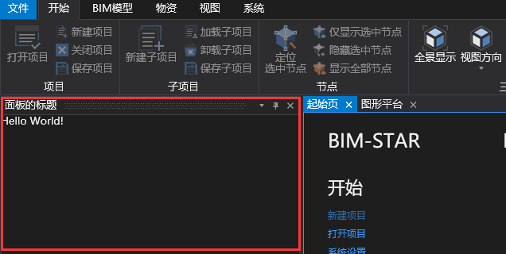

# 面板的设置

## 面板的显示

+ 这一章是在最基本的插件可以在BIM-STAR上加载的基础上进行讲解的，至于如何创建最基本的插件请点击[创建最基本的插件](https://github.com/bstar5/BSTAR-Samples/tree/master/samples/tutorial1)。

1. 在View文件夹下新建一个`FirstView.xaml`文件，内容如下所示。这个时候可能会出现`类型'ViewBase'不支持直接内容`的提示，添加了引用` System.Xaml`之后就可以解决这个问题了。

   ```html
   <core:ViewBase x:Class="CreatePluginDemo.Views.FirstView"
                xmlns="http://schemas.microsoft.com/winfx/2006/xaml/presentation"
                xmlns:x="http://schemas.microsoft.com/winfx/2006/xaml"
                xmlns:mc="http://schemas.openxmlformats.org/markup-compatibility/2006" 
                xmlns:d="http://schemas.microsoft.com/expression/blend/2008" 
                xmlns:local="clr-namespace:CreatePluginDemo.Views"
                xmlns:core="clr-namespace:WallE.Core;assembly=WallE.Core"
                mc:Ignorable="d" 
                d:DesignHeight="300" d:DesignWidth="300">
       <Grid>
           <TextBlock Text="Hello World!"></TextBlock>
       </Grid>
   </core:ViewBase>
   ```

2. 在ViewModel文件夹下新建一个`FirstViewModel.cs`文件，代码如下所示。虽然在这里不需要执行什么代码，但还是需要创建这个类的。至于为何请看[ViewModel与View的创建](https://github.com/bstar5/BSTAR-Samples/tree/master/samples/tutorial9) 。

   ```c#
   using WallE.Core;
   namespace CreatePluginDemo.ViewModels
   {
       public class FirstViewModel:ViewModelBase
       {
       }
   }
   ```

3. 在`MainPlugin.cs`中添加如下所示的代码。Install方法会在插件加载的时候执行，具体插件何时加载请看[创建最基本的插件](https://github.com/bstar5/BSTAR-Samples/tree/master/samples/tutorial1)章节中插件配置文件的详解一节。Install方法执行的时候会往视图菜单里添加一个按钮，点击按钮之后会执行ShowPane方法，关于菜单按钮的不理解，请看[Ribbon菜单的使用](https://github.com/bstar5/BSTAR-Samples/tree/master/samples/tutorial5)。

   ```c#
   private RibbonGroupViewModel _groupVm;
   private DockingPaneViewModel _dockingVm;
   private FirstViewModel _firstVm;
   private RibbonButtonViewModel _viewBtn;
   public void Install(IPluginInfo pluginInfo)
   {
       _groupVm = M.RibbonManager.GetRibbonGroup("BasicViewGroup");//获取视图菜单中的基本菜单组
       if (_groupVm != null)
       {
           _viewBtn = new RibbonButtonViewModel
           {
               Text = "展示HelloWorld面板",
               Click = new RelayCommand(ShowPane)//按钮命令
           };
           _groupVm.Items.Add(_viewBtn);//在基本菜单组里添加一个按钮
       }
       else
           this.ShowMessage("没有找到名称为ViewGroup的RibbonGroup！插件无法插入相关Ribbon菜单！");
   }

   private void ShowPane()
   {
       if (_dockingVm != null)
       {
           _dockingVm.IsActive = true;
           _dockingVm.IsHidden = false;
       }
       else
       {
           _firstVm = new FirstViewModel();
           _dockingVm = new DockingPaneViewModel(_firstVm)
           {
               Header = "面板的标题",
           };
           M.DockingManager.InsertPane(_dockingVm);
       }
   }
   ```

4. 按F5运行项目，菜单栏->视图->点击`弹出HelloWorld面板`按钮，效果如下所示。

   


## 面板的初始属性

| 属性名                  | 类型               | 作用                       |
| -------------------- | ---------------- | ------------------------ |
| Header               | string           | 面板标题                     |
| InitialPosition      | DockPosition（枚举） | 面板所处界面的位置，默认是在左边。        |
| IsActive             | bool             | 面板是否处于激活状态，默认是true       |
| IsHidden             | bool             | 面板是否处于隐藏状态，默认是false      |
| IsDocument           | bool             |                          |
| CanUserClose         | bool             | 用户是否可以关闭面板，默认是false      |
| CanFloat             | bool             |                          |
| IsFloating           | bool             |                          |
| IsFrontMode          | bool             |                          |
| IgnoreFrontMode      | bool             | 会如同图形平台面板一样依附起始页，默认false |
| PaneHeaderVisibility | Visibility       | 面板标题是否显示                 |

## 面板的显示\隐藏

+ 可以使用一个方法来控制面板的显示\隐藏，代码如下所示。

  ```c#
  private void ShowPane()
  {
      if (_dockingVm != null)
      {
          _dockingVm.IsActive = true;
          _dockingVm.IsHidden = false;
      }
      else
      {
          _firstVm = new FirstViewModel();
          _dockingVm = new DockingPaneViewModel(_firstVm)
          {
              Header = "面板的标题",
          };
          M.DockingManager.InsertPane(_dockingVm);
      }
  }
  ```


## 面板的卸载

+ 在MainPlugin.cs中的Uninstall方法里添加如下的代码。Uninstall方法会在插件卸载的时候执行。插件的卸载与插件的加载完全相反，比如在`config.plugin`配置文件中，设置插件登录时才加载，那么插件在注销登录时才会卸载，此时就会触发Uninstall方法。

  ```c#
  public void Uninstall()
  {
      //移除相关菜单按钮
      if (_groupVm != null)
         _groupVm.Items.Remove(_viewBtn);
      //关闭面板
      if (_dockingVm != null)
         M.DockingManager.RemovePane(_dockingVm);
      _dockingVm = null;
  }
  ```

