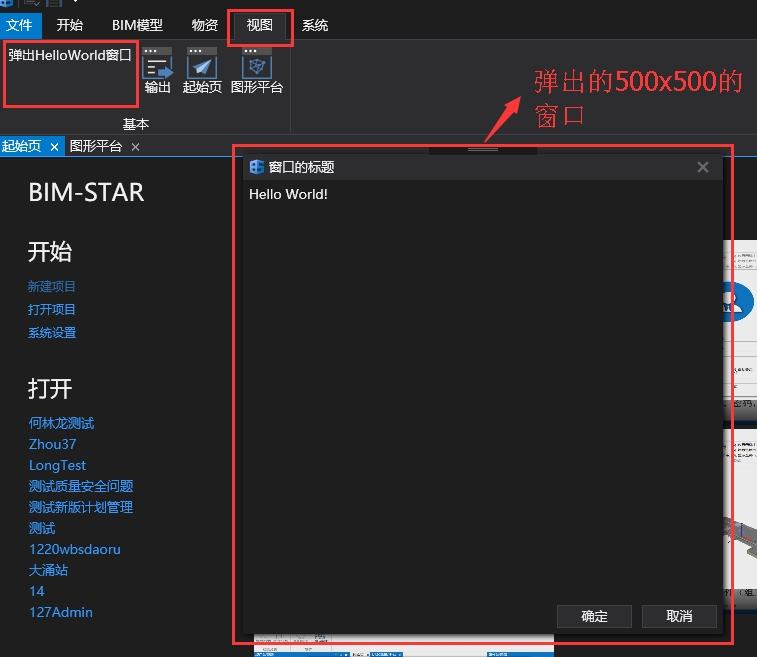

### 窗口的设置

#### 窗口的显示

+ 有时候需要把展示的界面用窗口的形式显示出来，那么MainPlugin.cs中代码应该如下。

  ```c#
  using CreatePluginDemo.ViewModels;
  using WallE.Core;
  namespace CreatePluginDemo
  {
      public class MainPlugin : IPlugin
      {
          private RibbonGroupViewModel _groupVm;
          private RibbonButtonViewModel _viewBtn;
          public void Install(IPluginInfo pluginInfo)
          {
              _groupVm = M.RibbonManager.GetRibbonGroup("BasicViewGroup");//获取视图菜单中的基本菜单组
              if (_groupVm != null)
              {
                  _viewBtn = new RibbonButtonViewModel
                  {
                      Text = "弹出HelloWorld窗口",
                      Click = new RelayCommand(ShowWindow)//按钮命令
                  };
                  _groupVm.Items.Add(_viewBtn);//在基本菜单组里添加一个按钮
              }
              else
                  this.ShowMessage("没有找到名称为ViewGroup的RibbonGroup！插件无法插入相关Ribbon菜单！");
          }

          private async void ShowWindow()
          {
              var firstVm = new FirstViewModel();
              var vm = new DialogViewModel(firstVm)
              {
                  Title = "窗口的标题",
                  Width = 500,
                  Height = 500
              };
              var result = await M.DialogManager.ShowDialogAsync(vm);
              if (result == CloseResult.Ok)
              {
                  //点击窗口的确定按钮后需要执行的代码
              }
          }

          public void Uninstall()
          {
              //移除相关菜单按钮
              if (_groupVm != null)
                  _groupVm.Items.Remove(_viewBtn);
          }
      }
  }
  ```

  ​

+ 按F5运行项目，菜单栏->视图->点击`弹出HelloWorld窗口`按钮，效果如下图所示。​​


