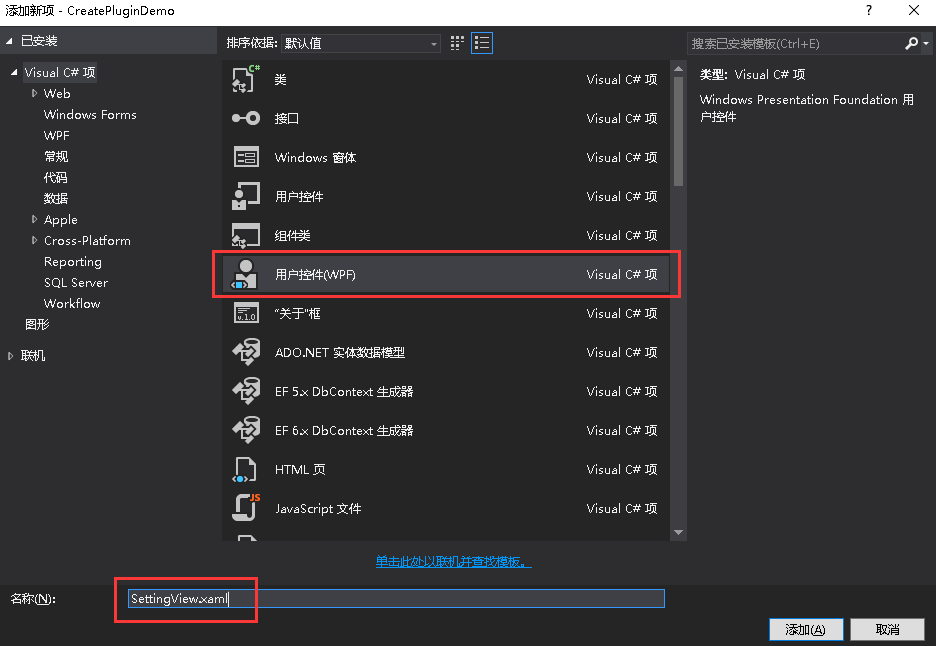

# 插件配置页的设置

+ 有时候我们需要第一次启动的时候保存一些插件的配置数据，第二次启动的时候，BIM-STAR系统会按照之前设置的数据选项来处理插件。比如每次启动BIM-STAR都会有起始页，那么我们可以在菜单栏->系统->系统设置->插件->起始页里取消勾选`启动时启动显示页`，那么再次启动BIM-STAR时候就不会有起始页显示了。接下来就讲解一下如何在系统设置里加入配置页的。
+ 这一章是在最基本的插件可以在BIM-STAR上加载的基础上进行讲解的，如何创建最基本的插件不再详述。

1. 首先添加`WallE.Assist.dll`引用，然后新建一个类，命名为`GlobalConfig.cs`，代码如下所示。

   ```c#
   using System.IO;
   using WallE.Assist;
   using WallE.Core;
   namespace CreatePluginDemo
   {
       public class GlobalConfig: SettingBase
       {
           private static readonly GlobalConfig _instance;

           public static GlobalConfig Ins
           {
               get { return _instance; }
           }

           static GlobalConfig()
           {
               _instance = new GlobalConfig();
           }

           public bool AlwaysShow
           {
               get { return Get<bool>("AlwaysShow"); }
               set { Set("AlwaysShow", value); }
           }

           public string Name
           {
               get { return Get<string>("Name"); }
               set { Set("Name", value); }
           }

           private GlobalConfig() : base(Path.Combine(CoreUtil.AppSettingDirectory, "MyFirstPlugin_Setting.json"))//配置的信息将作为一个json文件储存起来
           {
               //设置插件第一次配置的初始值
               SetDefaut("AlwaysShow", true);
               SetDefaut("Name", "您的名字是？");
           }
       }
   }
   ```


2. 然后在View文件夹里添加一个用户控件，命名为`SettingView.xaml`。

3. `SettingView.xaml`的代码内容如下所示。`CheckBox`控件的IsChecked绑定的是`GlobalConfig.cs`里的属性AlwaysShow，`TextBox`控件绑定的是GlobalConfig.cs里的属性Name。

   ```xml
   <UserControl x:Class="CreatePluginDemo.Views.SettingView"
                xmlns="http://schemas.microsoft.com/winfx/2006/xaml/presentation"
                xmlns:x="http://schemas.microsoft.com/winfx/2006/xaml"
                xmlns:mc="http://schemas.openxmlformats.org/markup-compatibility/2006" 
                xmlns:d="http://schemas.microsoft.com/expression/blend/2008" 
                xmlns:local="clr-namespace:CreatePluginDemo.Views"
                xmlns:createPluginDemo="clr-namespace:CreatePluginDemo"
                mc:Ignorable="d" 
                d:DesignHeight="300" d:DesignWidth="300">
       <Grid>
           <StackPanel>
               <CheckBox IsChecked="{Binding Source={x:Static createPluginDemo:GlobalConfig.Ins},Path=AlwaysShow,Mode=TwoWay}" Content="启动时显示我的插件的面板"/>
               <StackPanel Orientation="Horizontal">
                   <TextBlock Text="你的名字："/>
                   <TextBox Width="100" Text="{Binding Source={x:Static createPluginDemo:GlobalConfig.Ins},Path=Name,Mode=TwoWay}"/>
               </StackPanel>
           </StackPanel>
       </Grid>
   </UserControl>
   ```

4. 接着在`MainPlugin.cs`中添加如下代码。加载插件的时候对GlobalConfig.Ins.AlwaysShow进行判断是否显示面板。

   ```c#
   using CreatePluginDemo.ViewModels;
   using CreatePluginDemo.Views;
   using WallE.Core;
   namespace CreatePluginDemo
   {
       public class MainPlugin : IPlugin
       {
           private DockingPaneViewModel _dockingVm;
           private FirstViewModel _firstVm;
           public void Install(IPluginInfo pluginInfo)
           {
               if (GlobalConfig.Ins.AlwaysShow)
               {
                   _firstVm = new FirstViewModel();
                   _dockingVm = new DockingPaneViewModel(_firstVm)
                   {
                       Header = "面板的标题",
                   };
                   M.DockingManager.InsertPane(_dockingVm);
               }
               //系统设置中插件的设置界面
               M.SettingManager.AddPluginSettingItem("MyPluginSetting", new SettingItem("我的插件", new SettingView()));
           }

           public void Uninstall()
           {
               //关闭面板
               if (_dockingVm != null)
                   M.DockingManager.RemovePane(_dockingVm);
               _dockingVm = null;
               //移除设置界面
               M.SettingManager.RemovePluginSettingItem("MyPluginSetting");
           }
       }
   }
   ```

5. 在`View`文件夹中的新建一个`FirstView.xaml`，代码内容如下所示。控件`TextBlock`中的Text绑定的是`FirstViewModel.cs`中的通知属性`Name`。这里有不理解的地方可以看一下有关数据绑定的章节。

   ```xml
   <core:ViewBase x:Class="CreatePluginDemo.Views.FirstView"
                xmlns="http://schemas.microsoft.com/winfx/2006/xaml/presentation"
                xmlns:x="http://schemas.microsoft.com/winfx/2006/xaml"
                xmlns:mc="http://schemas.openxmlformats.org/markup-compatibility/2006" 
                xmlns:d="http://schemas.microsoft.com/expression/blend/2008" 
                xmlns:local="clr-namespace:CreatePluginDemo.Views"
                xmlns:core="clr-namespace:WallE.Core;assembly=WallE.Core"
                mc:Ignorable="d" 
                d:DesignHeight="300" d:DesignWidth="300">
       <Grid>
           <TextBlock Text="{Binding Name}"></TextBlock>
       </Grid>
   </core:ViewBase>
   ```

6. 在`ViewModel`文件夹中新建一个类，命名为`FirstViewModel.cs`，代码如下所示。

   ```c#
   using WallE.Core;
   namespace CreatePluginDemo.ViewModels
   {
       public class FirstViewModel:ViewModelBase
       {
           private string _name;
           /// <summary>
           /// 获取或设置Name属性
           /// </summary>
           public string Name
           {
               get { return _name; }
               set { Set("Name", ref _name, value); }
           }

           public FirstViewModel()
           {
               if (!string.IsNullOrEmpty(GlobalConfig.Ins.Name))
                   Name = "您好，" + GlobalConfig.Ins.Name;
               else
                   Name = "Hello World!";
           }
       }
   }
   ```

7. 按F5运行项目，就可以看到面板显示出来了，然后在菜单栏->系统->系统设置->插件->点击`我的插件`后可以看到如下图所示。

   

8. 在系统设置->我的插件中，取消勾选`启动时显示我的插件的面板`,再次打开的时候会发现，面板就不会在之后启动时显示出来了，这个时候可以通过给面板添加菜单按钮来控制面板的显示/隐藏，之前已经介绍过了，这里不再详述。在系统设置->我的插件中，你的名字一栏填写`深圳筑星科技`，之后再次启动时都会看到如下的效果。

   

   ​​
